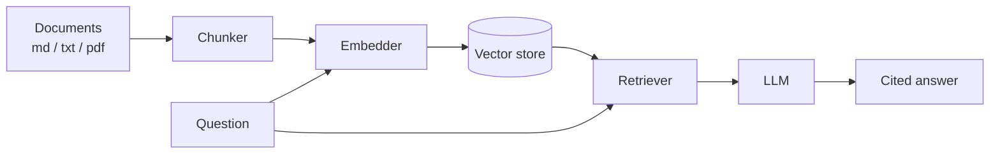

# docuqa

> A lightweight **Retrieval-Augmented Generation (RAG)** document Q&A assistant in Python.

Point it at a folder of documents, ask questions in plain language, and get
answers **grounded in your files** — with citations back to the source.

[](https://github.com/fluency05/docuqa/actions/workflows/ci.yml)
[](https://www.python.org/)
[](LICENSE)

---

## ✨ Features

- 📄 **Ingest many formats** — Markdown, plain text, reStructuredText, and PDF.
- 🧩 **Paragraph-aware chunking** — with configurable size and overlap.
- 🔍 **Semantic search** — cosine similarity over embeddings, backed by a
  dependency-light NumPy vector store (no external vector DB required).
- 🤖 **Cited answers** — every answer lists the source chunks it used.
- 💬 **Three interfaces** — one-shot `ask`, interactive `chat`, plus a Python API.
- ⚡ **Offline demo mode** — try the whole pipeline with zero API keys.
- 🧪 **Tested** — unit tests plus a GitHub Actions CI pipeline.

## 🧱 How it works



1. **Ingest** — documents are loaded, split into overlapping chunks, embedded,
   and stored in a local vector index.
2. **Ask** — the question is embedded, the most similar chunks are retrieved,
   and an LLM writes an answer citing those chunks.

## 🚀 Quickstart

### 1. Install

```bash
# Create and activate a virtual environment (recommended)
python -m venv .venv
# Windows:
.venv\Scripts\activate
# macOS / Linux:
source .venv/bin/activate

pip install -e .
```

### 2. Configure your API key

Copy the example environment file and fill in your OpenAI (or OpenAI-compatible)
API key:

```bash
copy .env.example .env        # Windows
# cp .env.example .env        # macOS / Linux
```

### 3. Index some documents

```bash
docuqa ingest examples
```

### 4. Ask questions

```bash
docuqa ask "What is Retrieval-Augmented Generation?"
```

Or start an interactive session:

```bash
docuqa chat
```

## ⚡ No API key? Try the offline demo

The offline mode uses a deterministic hashing embedder and a mock LLM, so you
can exercise the entire pipeline with no network access:

```bash
docuqa ingest examples --offline
docuqa ask "What does the FAQ say about pricing?" --offline
```

> Note: the offline embedder is **not** semantically meaningful, so retrieval
> quality is only illustrative. Use a real embedder for actual use.

## 🖥️ CLI reference

```text
docuqa ingest PATH... [--offline]   Load and index files or directories
docuqa ask QUESTION [--top-k N] [--offline]
                                    Answer a single question
docuqa chat [--offline]             Interactive Q&A session
docuqa stats                        Show current index info
```

Run `docuqa --help` for full details.

## 🐍 Python API

```python
from docuqa.config import Config
from docuqa.pipeline import RAGPipeline

pipeline = RAGPipeline(Config.from_env())
pipeline.ingest(["examples"])

answer = pipeline.ask("What regions does AcmeCloud support?")
print(answer.answer)
for result in answer.sources:
    print(result.chunk.source, result.score)
```

## ⚙️ Configuration

All settings are read from environment variables or a `.env` file:

| Variable                | Default                  | Description                          |
| ----------------------- | ------------------------ | ------------------------------------ |
| `OPENAI_API_KEY`        | —                        | API key (required unless `--offline`) |
| `OPENAI_BASE_URL`       | OpenAI default           | Any OpenAI-compatible endpoint       |
| `DOCUQA_MODEL`          | `gpt-4o-mini`            | Chat completions model               |
| `DOCUQA_EMBEDDING_MODEL`| `text-embedding-3-small` | Embeddings model                     |
| `DOCUQA_INDEX_DIR`      | `.docuqa`                | Where the index is stored            |
| `DOCUQA_CHUNK_SIZE`     | `500`                    | Max characters per chunk             |
| `DOCUQA_CHUNK_OVERLAP`  | `50`                     | Overlap between consecutive chunks   |
| `DOCUQA_TOP_K`          | `4`                      | Chunks retrieved per question        |

## 🗂️ Project structure

```text
docuqa/
├── src/docuqa/
│   ├── cli.py        # Typer + Rich command-line interface
│   ├── config.py     # Environment-driven configuration
│   ├── loader.py     # .txt / .md / .rst / .pdf loading
│   ├── chunker.py    # Paragraph-aware text chunking
│   ├── embedder.py   # OpenAI + offline hashing embedders
│   ├── store.py      # NumPy-backed in-memory vector store
│   ├── retriever.py  # Indexing + similarity search
│   ├── llm.py        # Prompt building + OpenAI/mock LLMs
│   ├── pipeline.py   # End-to-end orchestration
│   └── types.py      # Shared dataclasses
├── tests/            # pytest unit tests
├── examples/         # Sample documents to index
└── .github/workflows/ci.yml
```

## 🧪 Development

```bash
pip install -e ".[dev]"

# Run the test suite
pytest

# Lint
ruff check .
```

## 🗺️ Roadmap

- [ ] Persistent storage backends (Chroma, FAISS, Qdrant)
- [ ] Local embedding models via `sentence-transformers`
- [ ] A small web UI
- [ ] Streaming answers and chat history
- [ ] Retrieval evaluation metrics (recall, MRR)

## 📄 License

[MIT](LICENSE)
